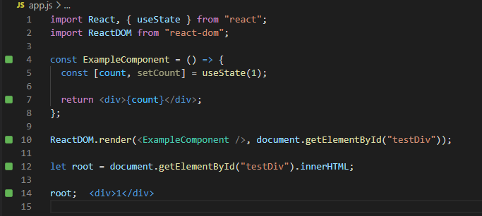
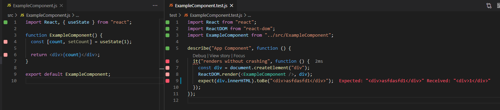

# Using Quokka & Wallaby with React

## Quokka Setup
1) All setup is in package.json (quokka property)
2) Quokka uses babel.config.js

#### How it looks

#### Resources
[Quokka Configuration Docs](https://quokkajs.com//configuration.html)

## Wallaby Setup
1) Install extension on vscode
2) Create wallaby.js file
3) Start with Ctrl + Shift + R -> R

#### How it looks (success)

#### How it looks (failure)
