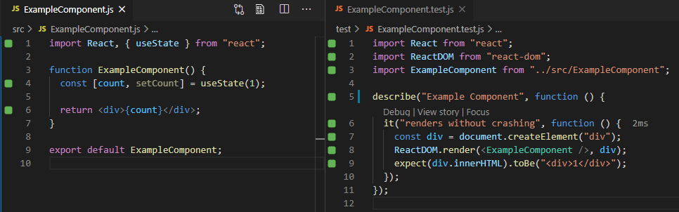
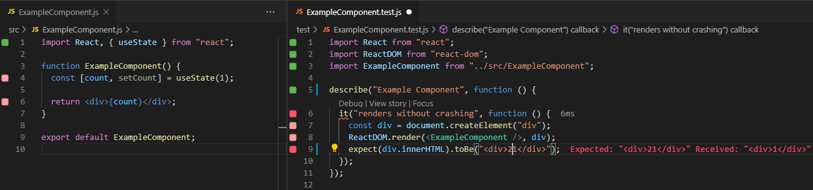

# Using Quokka & Wallaby with React


## Quokka Setup
1) All setup is in package.json (quokka property)
2) Quokka uses babel.config.js

#### How it looks

#### Resources
[Quokka Configuration Docs](https://quokkajs.com//configuration.html)


## Wallaby Setup
1) Install extension on vscode
2) Create wallaby.js file
3) Start with Ctrl + Shift + R -> R

#### How it looks (success)


#### How it looks (failure)


### Mocking "fetch" in tests
1) You need to polyfill "fetch" in your Node. Start with creating "jest.config.js"
```js
module.exports = {
  setupFiles: ["./jest.setup.js"],
};
```

2) Create "jest.setup.js"
```js
// This ensures you can use `window.fetch()` in your Jest tests.
require("whatwg-fetch");
```

3) In your tests you can mock servers now
```js
import { rest } from "msw";
import { setupServer } from "msw/node";

const server = setupServer(
  rest.post(
    "https://auth-provider.example.com/api/login",
    async (req, res, ctx) => {
      if (!req.body.password) {
        return res(ctx.status(400), ctx.json({ message: "password required" }));
      }
      if (!req.body.username) {
        return res(ctx.status(400), ctx.json({ message: "username required" }));
      }
      return res(ctx.json({ username: req.body.username }));
    }
  )
);
```

### 5 Steps in tests
1) Setup (beforeEach, beforeAll, afterEach, afterAll)
2) Render Components
3) Get Element References
4) Act
5) Assert

### Injecting Environment Variables to Babel or other compilers
In wallaby.js file, directly define your environment variables. Reload your configuration file for Wallaby.
```js
// wallaby.js
process.env.myVAR = "hello goki";
```

### Finding Elements
Easy way
```jsx
import {render} from "@testing-library/react";
const {getByText) = render(<MyComponent />);
getByText(/myTextHere/i);
```

For Input Elements
```jsx
import {render} from "@testing-library/react";
const {getByLabelText) = render(<MyComponent />);
getByLabelText(/Username/i);
```

Last Option (by test id)
```jsx
import {render} from "@testing-library/react";
const {getByTestId) = render(<MyComponent />);
getByTestId(/Username/i);
```

### User Actions

Typing
```jsx
import userEvent from "@testing-library/user-event";

userEvent.type(InputElement, "stuffhere");
```

Clicking
```jsx
import { fireEvent } from "@testing-library/react";

fireEvent.click(ButtonElement);
```

### Async Assertions

Wait for element to appear
```jsx
import { waitFor } from "@testing-library/react";

await waitFor( () => {
  expect(getByText("helloworld")).toBeTruthy();
})
```

Wait for a function to be called with args
```jsx
import { waitFor } from "@testing-library/react";

await waitFor( () => {
  expect(window.console.log).toHaveBeenCalledWith("hello");
})
```

# Testing Express API

### Setup
1) Install Dependencies
```js
axios
express
jsdom
jest
```
